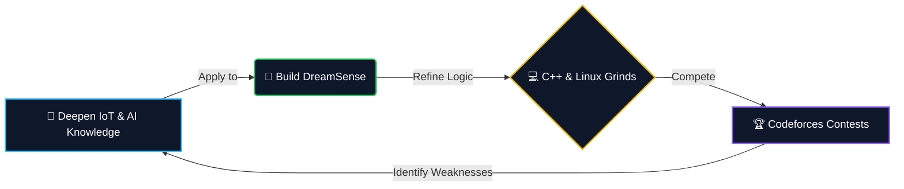

<div align="center">
  
</div>

<div align="center">
  <br/>
  <a href="https://github.com/denvercoder1/readme-typing-svg">
    
  </a>
  <br/>
  <p>
    
    
    
  </p>
</div>

<div align="center">
  
</div>

---

##  What Drives Me

<div align="center">

```python
class Developer:
    def __init__(self):
        self.name = "Arunava Bhol"
        self.role = "3rd-Year BTech CSE Student @ Techno India University"
        self.core_skills = ["C/C++", "Linux/Bash", "Java", "Python"]
        
    def get_milestones(self):
        return {
            "competitive_programming": "Specialist on Codeforces",
            "hackathons": "Cleared Both Rounds of TCS CodeVita Season 13",
            "active_project": "DreamSense (EEG-based trauma rehab framework)",
            "long_term_goal": "Reach Candidate Master (Violet) on CF"
        }

me = Developer()
```

</div>

---

##  Tech Arsenal

<div align="center">


<br/><br/><br/>

<table>
<tr>
<td align="center">

**💻 Core Languages & Logic**

<table>
<tr>
<td align="center" width="120"><br/><b>C</b></td>
<td align="center" width="120"><br/><b>C++</b></td>
<td align="center" width="120"><br/><b>Java</b></td>
<td align="center" width="120"><br/><b>Python</b></td>
</tr>
</table>

   

</td>
</tr>
<tr>
<td align="center">

**🐧 Systems & Scripting**

<table>
<tr>
<td align="center" width="120"><br/><b>Linux</b></td>
<td align="center" width="120"><br/><b>Bash</b></td>
<td align="center" width="120"><br/><b>Git</b></td>
</tr>
</table>

  

</td>
</tr>
<tr>
<td align="center">

**🗄️ Web & Databases**

<table>
<tr>
<td align="center" width="120"><br/><b>HTML5</b></td>
<td align="center" width="120"><br/><b>SQL</b></td>
<td align="center" width="120"><br/><b>MySQL</b></td>
</tr>
</table>

  

</td>
</tr>
</table>

<br/><br/><br/>


</div>

---

## 🏆 Achievements & Milestones

<div align="center">

<table>
<tr>
<td width="50%" valign="top" align="center" style="padding: 20px;">
<h3> Codeforces Specialist</h3>
<p>Continuously optimizing algorithmic logic and climbing the global ranks. Current long-term goal: <b>Candidate Master (Violet)</b>.</p>
</td>
<td width="50%" valign="top" align="center" style="padding: 20px;">
<h3> TCS CodeVita Season 13</h3>
<p>Successfully cleared <b>both rounds</b> of the global competition by conquering complex pathfinding and simulation problems in C.</p>
</td>
</tr>
</table>

</div>

---

##  Featured Projects - Built With Passion

<div align="center">

<table>
<tr>
<td width="50%" valign="top">

<table border="0" cellpadding="0" cellspacing="0">
<tr>
<td style="border: none; padding-right: 5px;">

</td>
<td style="border: none;">
<a href="PUT_YOUR_DREAMSENSE_REPO_LINK_HERE">

</a>
</td>
</tr>
</table>
<div align="center">

</div>

<br/>

**EEG-Based Trauma Rehab Framework**

• Analyzes EEG signals for subconscious stressors  
• Bypasses verbal communication barriers  
• Designed for IDEAPOLIS'26 Hackathon  

`C++` `IoT Integration` `Neural Processing` `AI`

</td>
<td width="50%" valign="top">

<table border="0" cellpadding="0" cellspacing="0">
<tr>
<td style="border: none; padding-right: 5px;">

</td>
<td style="border: none;">
<a href="PUT_YOUR_OCR_REPO_LINK_HERE">

</a>
</td>
</tr>
</table>
<div align="center">

</div>

<br/>

**Automated OCR Data Entry System**

• Converts unstructured documents to structured data  
• Built using Tesseract and Pandas integrations  
• Eliminates manual data entry overhead  

`Python` `OpenCV` `Tesseract` `Data Science`

</td>
</tr>

</table>

</div>


---

##  GitHub Analytics

<div align="center">


<br/><br/>


</div>

---

##  Connect & Follow My Journey

<div align="center">
  <table border="0" cellpadding="0" cellspacing="0" width="80%">
    <tr>
      <td align="center" style="border: none; padding: 20px;">
        
        
        <br/><br/>
        <a href="YOUR_LINKEDIN_URL_HERE">
          
        </a>
        <a href="YOUR_INSTAGRAM_URL_HERE">
          
        </a>
      </td>
      <td align="center" style="border: none; padding: 20px;">
        
        
        <br/><br/>
        <a href="mailto:YOUR_EMAIL_ADDRESS_HERE">
          
        </a>
      </td>
    </tr>
  </table>
</div>

---

##  Content & Learning

<div align="center">
  <table border="0" cellpadding="0" cellspacing="0">
    <tr>
      <td align="center">
        
        <br><strong>Competitive Programming</strong>
        <br>Continuously optimizing logic & climbing ranks on Codeforces
        <br><em>Efficiency • Speed</em>
      </td>
      <td align="center">
        
        <br><strong>Hardware & AI Systems</strong>
        <br>Bridging the gap between physical signals and intelligent software
        <br><em>Build → Test → Innovate</em>
      </td>
      <td align="center">
        
        <br><strong>Creative Storytelling</strong>
        <br>Building a personal brand through technical writing and aesthetic design
        <br><em>Clarity over complexity</em>
      </td>
    </tr>
  </table>
</div>
---

##  Current Focus Loop

<div align="center">



*(Continuously iterating between theory, building, and competitive programming)*
</div>
---

##  Philosophy

<div align="center">
  
</div>

---

<div align="center">
  
  
  ###  Ready to build something amazing together?
  
  
  
  ** Star my repositories if you find them helpful!!**
  
</div>
